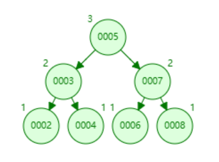
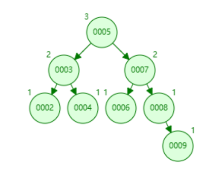

# AVL树的底层实现

## AVL树

AVL树是一种自平衡的二叉搜索树，它通过旋转操作来保持树的平衡。AVL树的每个节点都有一个平衡因子，平衡因子是左子树的高度减去右子树的高度。AVL树的平衡因子可以是-1、0或1。如果平衡因子的绝对值大于1，则树是不平衡的，需要进行旋转操作来恢复平衡。

## AVL树除了旋转部分的代码实现

### AVL树除了旋转的部分,与二叉搜索树基本相同,所以在这里不再赘述
    #include<iostream>
    #include<assert.h>
    using namespace std;
    template<class K, class V>
    struct AVLTreeNode
    {
        pair<K, V> _kv;
        AVLTreeNode<K, V>* _left;
        AVLTreeNode<K, V>* _right;
        AVLTreeNode<K, V>* _parent;
        int _bf; // balance factor

        AVLTreeNode(const pair<K, V>& kv)
            :_kv(kv)
            , _left(nullptr)
            , _right(nullptr)
            , _parent(nullptr)
            , _bf(0)
        {}
    };

    template<class K, class V>
    class AVLTree
    {
        typedef AVLTreeNode<K, V> Node;
    public:
        AVLTree() = default;

        AVLTree(const AVLTree<K, V>& t)
        {
            _root = Copy(t._root);
        }

        AVLTree<K, V>& operator=(AVLTree<K, V> t)
        {
            swap(_root, t._root);
            return *this;
        }

        ~AVLTree()
        {
            Destroy(_root);
            _root = nullptr;
        }

        bool Insert(const pair<K, V>& kv)
        {
            if (_root == nullptr)
            {
                _root = new Node(kv);
                return true;
            }

            Node* parent = nullptr;
            Node* cur = _root;
            while (cur)
            {
                if (cur->_kv.first < kv.first)
                {
                    parent = cur;
                    cur = cur->_right;
                }
                else if (cur->_kv.first > kv.first)
                {
                    parent = cur;
                    cur = cur->_left;
                }
                else
                {
                    return false;
                }
            }

            cur = new Node(kv);
            if (parent->_kv.first < kv.first)
            {
                parent->_right = cur;
            }
            else
            {
                parent->_left = cur;
            }
            cur->_parent = parent;

            return true;
        }

        Node* Find(const K& key)
        {
            Node* cur = _root;
            while (cur)
            {
                if (cur->_key < key)
                {
                    cur = cur->_right;
                }
                else if (cur->_key > key)
                {
                    cur = cur->_left;
                }
                else
                {
                    return cur;
                }
            }

            return nullptr;
        }

        void InOrder()
        {
            _InOrder(_root);
            cout << endl;
        }

    private:
        void _InOrder(Node* root)
        {
            if (root == nullptr)
            {
                return;
            }

            _InOrder(root->_left);
            cout << root->_kv.first << ":" << root->_kv.second << endl;
            _InOrder(root->_right);
        }

        void Destroy(Node* root)
        {
            if (root == nullptr)
                return;

            Destroy(root->_left);
            Destroy(root->_right);
            delete root;
        }

        Node* Copy(Node* root)
        {
            if (root == nullptr)
                return nullptr;

            Node* newRoot = new Node(root->_key, root->_value);
            newRoot->_left = Copy(root->_left);
            newRoot->_right = Copy(root->_right);

            return newRoot;
        }

    private:
        Node* _root = nullptr;
    };

## 平衡因子

### 这里用bf(balance factor)来表示平衡因子,这里我们用右子树的高度减去左子树的高度来表示平衡因子,所以就有了下面这段代码

    if (cur == parent->_left)
        parent->_bf--;
    else
        parent->_bf++;

在插入节点的时候,如果插入的节点是左子树,那么父节点的平衡因子就减一,如果插入的节点是右子树,那么父节点的平衡因子就加一,可是,我们不能只判断子节点的父节点,如图所示:

这是一个满二叉树,所有节点的bf都是0:

现在插入一个节点9:

可以看到,节点8的左子树(nullptr)与右子树(9)的高度差为1,可是这里又要引入新的问题,7的左子树(6)和右子树(8)的高度差也是1,同理5的左子树和右子树高度差也是1,这里我们就要通过回溯来更新所有节点的平衡因子

    if (parent->_bf == 1 || parent->_bf == -1)
    {
        // 往上更新
        cur = parent;
        parent = parent->_parent;
    }

目的就是让这棵树上的所有父辈节点的平衡因子都更新到正确的值

通过while循环重复执行这段代码

    if (cur == parent->_left)
        parent->_bf--;
    else
        parent->_bf++;

例如这个:

此时8为parent,9为cur,所以8->bf++,然后向上更新,让cur指向8,parent指向7,最终让所有节点都更新到正确的bf值

## 问题来了!
### 8的左边在插入一个节点呢?此时8的bf应该变为0,而别的不变,所以当一个parent的bf为0的时候,直接break,不再更新祖辈节点,这样就解决了这个问题
所以就有了这段代码:

    while (parent)
    {
        if (cur == parent->_left)
            parent->_bf--;
        else
            parent->_bf++;

        if (parent->_bf == 0)
        {
            break;
        }
        else if (parent->_bf == 1 || parent->_bf == -1)
        {
            // 继续往上更新
            cur = parent;
            parent = parent->_parent;
        }
        else if (parent->_bf == 2 || parent->_bf == -2)
        {
            // TODO:旋转
        }
        else
        {
            assert(false);
        }
    }

所以前半段代码如下:

    #include<iostream>
    #include<assert.h>
    using namespace std;
    template<class K, class V>
    // 为节省篇幅先省略结构体定义

    template<class K, class V>
    class AVLTree
    {
        typedef AVLTreeNode<K, V> Node;
    public:

        // 为节省篇幅先省略构造析构

        bool Insert(const pair<K, V>& kv)
        {
            // 为节省篇幅先省略插入部分

            // 更新平衡因子
            while (parent)
            {
                if (cur == parent->_left)
                    parent->_bf--;
                else
                    parent->_bf++;

                if (parent->_bf == 0)
                {
                    break;
                }
                else if (parent->_bf == 1 || parent->_bf == -1)
                {
                    // 继续往上更新
                    cur = parent;
                    parent = parent->_parent;
                }
                else if (parent->_bf == 2 || parent->_bf == -2)
                {
                    // TODO:旋转
                }
                else
                {
                    assert(false);
                }
            }

            return true;
        }

        Node* Find(const K& key)
        {
            // 为节省篇幅先省略
        }

        void InOrder()
        {
            _InOrder(_root);
            cout << endl;
        }

    private:
        void _InOrder(Node* root)
        {
            // 为节省篇幅先省略
        }

        void Destroy(Node* root)
        {
            // 为节省篇幅先省略
        }

        Node* Copy(Node* root)
        {
            // 为节省篇幅先省略
        }

    private:
        Node* _root = nullptr;
    };