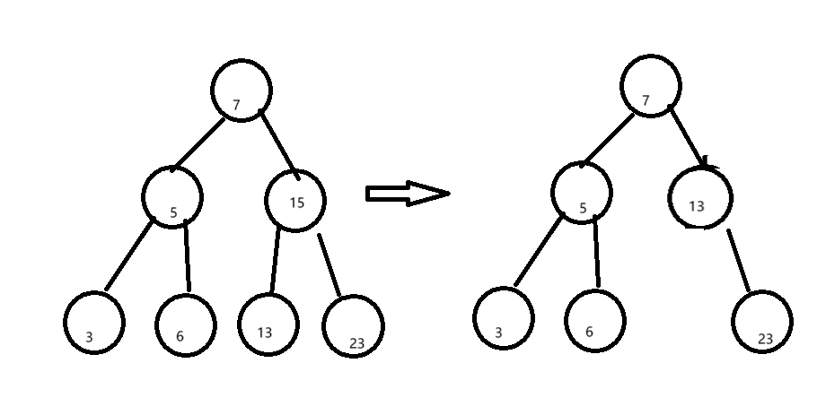
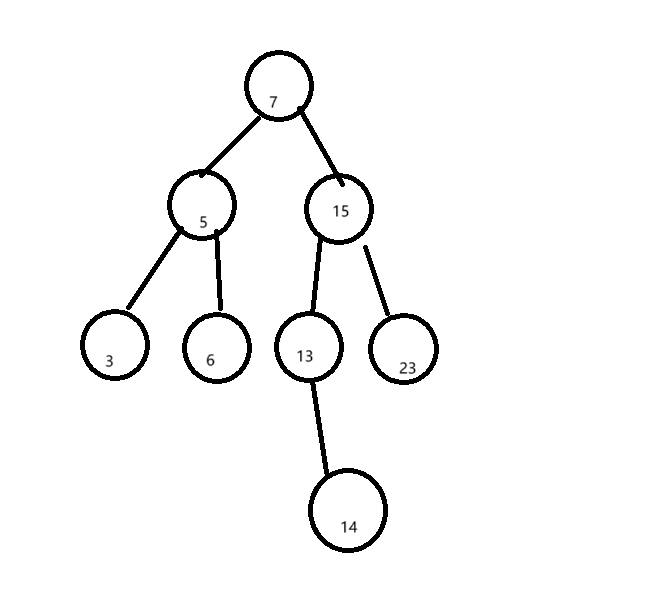

# 记录一下在写二叉搜索树时候遇到的困难吧

    bool Erase(const K& key)
    {
        if (_root == nullptr)
        {
            return false;
        }

        Node* parent = nullptr;
        Node* cur = _root;

        while (cur)
        {
            if (cur->_key > key)
            {
                parent = cur;
                cur = cur->_left;
            }
            else if (cur->_key < key)
            {
                parent = cur;
                cur = cur->_right;
            }
            else //开删
            {
                //如果只有0-1个孩子的话
                if (cur->_left == nullptr)
                {
                    if (parent == nullptr)
                    {
                        _root = cur->_right;
                    }
                    else
                    {
                        if (parent->_left == cur)
                        {
                            cur = cur->_right;
                            parent->_left = cur;
                        }
                        else
                        {
                            cur = cur->_right;
                            parent->_right = cur;
                        }
                    }

                    delete cur;
                    return true;
                }
                else if (cur->_right == nullptr)
                {
                    if (parent == nullptr)
                    {
                        _root = cur->_left;
                    }
                    else
                    {
                        if (parent->_left == cur)
                        {
                            cur = cur->_left;
                            parent->_left = cur;
                        }
                        else
                        {
                            cur = cur->_left;
                            parent->_right = cur;
                        }
                    }

                    delete cur;
                    return true;
                }
                else //两个孩子的情况
                {
                    Node* leftmaxParent = cur;
                    Node* leftmax = cur->left;

                    while (leftmax->_right)
                    {
                        leftmaxParent = leftmax;
                        leftmax = leftmax->_right;
                    }

                    cur->_key = leftmax->_key;
                    cur->_value = leftmax->_value;

                    if (leftmaxParent->_right == leftmax)
                    {
                        leftmaxParent->_right = leftmax->_left;
                    }
                    else
                    {
                        leftmaxParent->_left = leftmax->_left;
                    }

                    delete leftmax;
                    return true;
                }
            }
        }

        return false;
    }

### 附:突然发现vscode里面的md文件写代码的时候不用''',直接用四个空格就可以

删除操作中,如果一个节点有两个子节点,就选择左面最大值或者右面最小值当做这个节点的替代品,然后删除这个节点,这样就能保证删除后仍然是一棵二叉搜索树,搜索过程如下:定义一个左边最大节点,以及他的父节点,然后通过while找到左边最大,再进行赋值,但是考虑到有可能直接不进行while循环,所以需要判断一下

如何判断有没有进行while呢,如果进行了while的话,那么leftmaxParent->_right = leftmax->_left;一定成立,否则的话,就说明没有进行while循环,那么leftmaxParent->_left = leftmax->_left;一定成立,所以直接判断这个就行

例如,我们删除这个15,他有两个子节点,我们把他左面的13拿过来,但是这个时候就是不触发while的情况了,所以我们判断leftmaxParent->_right == leftmax,显然,15的右节点不等于这个,所以我们让15左边指向13左节点,也就是nullptr

那么我们如果我们进行while循环呢,假设13下面还有别的节点

## 也就是这种情况

这个时候,13右节点是14,肯定进行了while循环,这个时候呢,leftmaxParent是13,右节点leftmax是14,所以leftmaxParent->_right = leftmax->_left;成立,直接让13的右节点指向14的左节点,也就是13指向空(此时15已经被替换成14了),然后再删除15就可以了